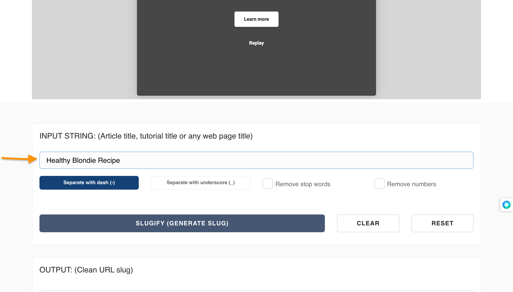

[https://downshiftology.com/recipes/gluten-free-chocolate-chip-cookies/]: https://downshiftology.com/recipes/gluten-free-chocolate-chip-cookies/
[URL]: https://www.codecademy.com/resources/docs/general/url
[slugify.online]: https://slugify.online/

## Introduction

Picture this. You're scrolling through the internet, find a cookie recipe, and click on the "Share" button to send this link to your friend:
[https://downshiftology.com/recipes/gluten-free-chocolate-chip-cookies/]

You see `gluten-free-chocolate-chip-cookies` after the backslash (`/`) and at the end of the web address. This is called a **slug**. Slugs are a vital part of a [URL] that helps identify a particular page on a website in a user-friendly manner. Essentially, slugs identify the content found on the page. In this article, you will learn the importance of slugs in SEO strategy, how to create them, and strategies you can use to make your URL slugs effective.

## Why Are Slugs Important to SEO Strategy?

Even though slugs won't have a direct impact on how your content ranks on the web, they do influence a visitor's decision on whether to view your content or not. Here's how:

1. **Increases Search Ranking:** Cannibalization is a common issue for content creators. It's when most of the blog posts, articles, and other pieces of content on a website share the same keyword. This makes it difficult for people to find them on your site. Slugs solve this issue by putting a unique name like a title or heading, thus, making it easier for people to find a person's work. Think of this as the names of the folders on your Google Drive or OneDrive account.

2. **Improves Shareability:** Adding slugs to your content's URLs makes them shorter, thus, making it easier for your viewers to copy, paste, and send them to other people.

Now, let's create a slug!

## How To Create a Slug

### Method 1: Manually

1. **Think of a short yet descriptive name:**  When it comes to creating the name for your URL slug, we recommend keeping it under 2,000 characters. According to [John Mueller from Google](https://www.seroundtable.com/google-url-characters-18219.html), the website favors URLs that meet this amount. Also, we recommend basing the name of your URL's slug on the page's content and using lowercase characters so that Google and other search engines rank it in the query your content belongs to. For example, let's say a person wanted to create a slug for a tutorial on creating issue requests on GitHub. The description could be, "how to make your issue requests come true."

2. **Place hyphens ("-") in between the parts of your name:**  Normally, spaces appear between a title to make things clear. In the case of URLs however, spaces are often replaced with "%20", which is not very legible. Hyphens, on the hand, don't get replaced, which makes your URL slug easier to read. For example, the URL slug, `how-to-make-your-issue-requests-come-true` is easier to understand than `how%20to%20%make%20%your%20issue%20requests%20come%true`.

Your URL is now SEO-Friendly!

### Method 2: Use a URL Slug Generator

Creating a URL slug for your content can be time-consuming, so we suggest using a tool like [slugify.online] to help you finish quickly:

1. Type your content's title in the textbox titled **INPUT STRING**. Make sure that the **Separate with a dash (-)** option is highlighted.

1. Click on **Slugify(Generate Slug)**

1. Click on **Copy**. Then, add it to your website's URL.

## Conclusion

As peculiar as the name is, URL slugs are an important part of the internet in identifying websites. They help people find your content and can even make someone laugh. So next time you're creating a URL slug, make sure it is clear and easy to remember. You'll never know, it might be the very thing that helps you land the job of your dreams.
