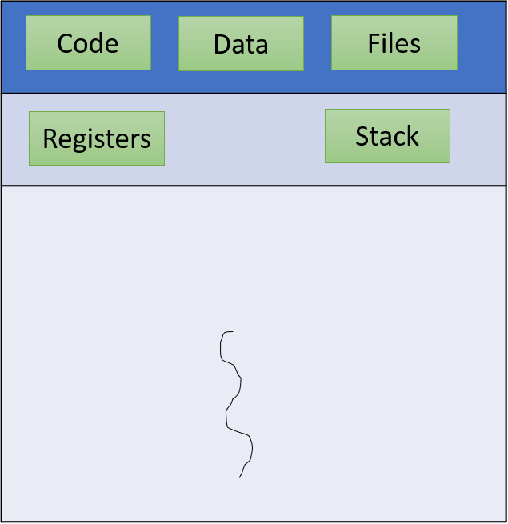
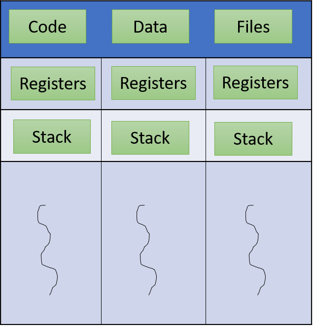
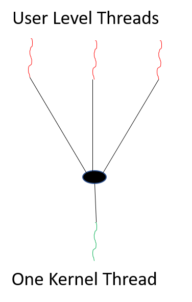
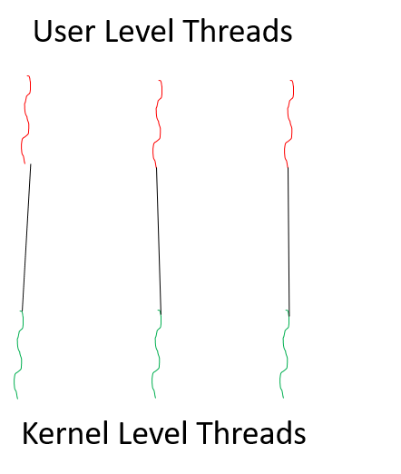
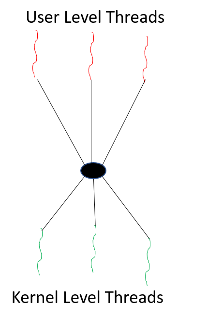

_**Prerequisites:** Understanding of C, Operating System, Visual studio code_  
_**Version:** Standard C language versions C89/C90, C99, C11, and C18_

## Introduction

A `thread` is a path of execution within a process. A process can contain multiple threads. A thread is also known as lightweight process. The idea is to achieve parallelism by dividing a process
into multiple threads. For example, in a browser, multiple tabs can be different threads. MS Word uses multiple threads: one thread to format the text, another thread to process inputs, etc.

**`Thread`** is an execution unit which consists of its own program `counter`, a `stack`, and a set of `registers`. `Program counter` keeps track of which instruction to execute next, system registers which hold its current working variables, and a stack which contains the execution history.

**A thread comprises of:**

- Thread ID
- Program Counter
- Register Set
- Stack

**A thread shares with other threads:**

- Code Section
- Data Section
- Other resources like - open files

Single Thread             |  Multiple threads
:-------------------------:|:-------------------------:
| 

## Multithreading

- A `thread` is a path which is followed during a program’s execution.
- Let's consider an instance where a program cannot simultaneously read keystrokes and create drawings. These activities pose a challenge for the program as they cannot be performed concurrently. However, this issue can be resolved through multitasking, enabling the program to execute multiple tasks simultaneously.
- Multitasking is of two types: `Processor based` and `thread based`.
- `Processor based` multitasking is totally managed by the OS, however multitasking through multithreading can be controlled by the programmer to some extent.
- The concept of multi-threading needs proper understanding of these two terms – a `process` and a `thread`.
- A process is a program being executed. A process can be further divided into independent units known as threads.
- A `thread` is like a small light-weight process within a process Or we can say a collection of threads is what is known as a process.

## Process vs Thread

| S.N.      | Process | Thread |
| -- | ----------- | ----------- |
| 1      | Process is heavy weight or resource intensive.| Thread is light weight, taking lesser resources than a process.      |
| 2   | Process switching needs interaction with operating system.        | Thread switching does not need to interact with operating system. |
| 3 | In multiple processing environments, each process executes the same code but has its own memory and file resources. | All threads can share same set of open files, child processes. |
| 4 | If one process is blocked, then no other process can execute until the first process is unblocked. | While one thread is blocked and waiting, a second thread in the same task can run. |
| 5 | Multiple processes without using threads use more resources. | Multiple threaded processes use fewer resources. |
| 6 | In multiple processes each process operates independently of the others. | One thread can read, write or change another thread's data. |

## Challenges for Programmers while creating Threads

- `Dividing activities` – It involves finding the functions within the job that can be run in parallel on separate processors.
- `Balance` – The task assigned to each processor must also be equal. Now there can be different parameters for that. One parameter can be, assign equal tasks to each processor. But, tasks assigned to more processor may require higher execution time thus overloading one processor. Thus, simply assigning equal tasks to each processor may not work.
- `Data splitting` – Another challenge is to split the data required for each task.
- `Data dependency` – sometimes the data required by one thread (T1) might be produced by another (T2). Thus, T1 can not run before T2. Therefore, it becomes difficult for programmers to code.
- `Testing and debugging` – Multiple threads running in parallel on multiple cores poses another challenge in the testing of applications.

## Syntax

```c
#include <pthread.h>

int pthread_create(pthread_t *thread, const pthread_attr_t *attr, void *(*start_routine)(void *), void *arg);
```

- `thread`: A pointer to a pthread_t variable that will store the thread ID of the newly created thread.
- `attr`: An optional pointer to a pthread_attr_t structure that specifies the attributes of the thread (such as its stack size or scheduling policy). You can pass NULL for default attributes.
- `start_routine: A function pointer to the function that will be executed by the thread. It should have the following signature: void *function_name(void *arg). It takes a single argument arg and returns a void * pointer.
- `arg`: An optional argument that can be passed to the start_routine function. It can be used to provide data or parameters to the thread.

The `pthread_create` function returns 0 on success, indicating that the thread was successfully created. On failure, it returns an error code indicating the cause of the failure.

Remember to link your program with the `pthread` library by adding `-pthread` to the compiler command during the compilation process.

## Examples

**Now we will see how to create  threads using Pthread with code sample in `C`:**

```c
#include <stdio.h>
#include <pthread.h>

void *factorial(void *arg) {
    int num, fact = 1;
    printf("Enter a number to find its factorial: ");
    scanf("%d", &num);

    for (int i = 1; i <= num; i++) {
        fact *= i;
    }

    printf("Factorial of %d is %d\n", num, fact);
    pthread_exit(NULL);
}

void *hcf(void *arg) {
    int num1, num2, hcf;
    printf("Enter two numbers to find their HCF: ");
    scanf("%d %d", &num1, &num2);

    int temp1 = num1, temp2 = num2;

    while (num1 != num2) {
        if (num1 > num2) {
            num1 -= num2;
        } else {
            num2 -= num1;
        }
    }

    hcf = num1;
    printf("HCF of %d and %d is %d\n", temp1, temp2, hcf);
    pthread_exit(NULL);
}


int main() {
    pthread_t thread_factorial, thread_hcf;
    int choice;

    printf("Choose an option:\n");
    printf("1. Find factorial of a number\n");
    printf("2. Find HCF of two numbers\n");
    printf("Enter your choice (1 or 2): ");
    scanf("%d", &choice);

    if (choice == 1) {
        pthread_create(&thread_factorial, NULL, factorial, NULL);
        pthread_join(thread_factorial, NULL);
    } else if (choice == 2) {
        pthread_create(&thread_hcf, NULL, hcf, NULL);
        pthread_join(thread_hcf, NULL);
    } else {
        printf("Invalid choice. Exiting.\n");
        return 1;
    }

    printf("Program completed. Exiting.\n");
    return 0;
}
```

To compile the above code, you have to use following command:

```shell
chmod u+x filename.c
gcc -o multithreading multithreading.c -pthread
./multithreading 
```

The output for the above code will be:

```shell
Threading % ls
thread.c

Threading % chmod u+x thread.c 

Threading % gcc -o multithreading thread.c -pthread

Threading % ls
multithreading thread.c

Threading % ./multithreading 
Choose an option:
1. Find factorial of a number
2. Find HCF of two numbers
Enter your choice (1 or 2): 2
Enter two numbers to find their HCF: 10 15
HCF of 10 and 15 is 5
Program completed. Exiting.

Threading % ./multithreading 
Choose an option:
1. Find factorial of a number
2. Find HCF of two numbers
Enter your choice (1 or 2): 1
Enter a number to find its factorial: 3
Factorial of 3 is 6
```


**Program to pass message from main function to threads in `C`:**

```c
#include <pthread.h>
#include <stdlib.h>
#include <stdio.h>

void *myfunc(void *myvar);

int main(int argc, char *argv[])
{
    pthread_t thread1, thread2;
    char *msg1 = "first thread";
    char *msg2 = "second thread";
    int ret1, ret2;

    ret1 = pthread_create(&thread1, NULL, myfunc, (void *)msg1);
    ret2 = pthread_create(&thread2, NULL, myfunc, (void *)msg2);

    printf("Main function after pthread_create \n");

    pthread_join(thread1, NULL);
    pthread_join(thread2, NULL);

    printf("first thread ret1 = %d \n", ret1);
    printf("second thread ret2 = %d \n", ret2);

    return 0;
}

void *myfunc(void *myvar)
{
    char *msg;
    msg = (char *)myvar;
    int i;

    for (i = 0; i < 10; i++)
    {
        printf("%s %d \n", msg, i);
        sleep(2);
    }

    return NULL;
}
```

To compile the above code, you have to use following command:

```shell
chmod u+x filename.c
gcc filename.c -o pthread_example -pthread
./pthread_example
```

The output for the above code will be:

```shell
Threading2 % ls
message.c

Threading2 % chmod u+x message.c 
Threading2 % gcc message.c -o pthread_example -pthread

Threading2 % ls
message.c	pthread_example

Threading2 % ./pthread_example 
Main function after pthread_create 
first thread 0 
second thread 0 
first thread 1 
second thread 1 
first thread 2 
second thread 2 
first thread 3 
second thread 3 
second thread 4 
first thread 4 
second thread 5 
first thread 5 
second thread 6 
first thread 6 
second thread 7 
first thread 7 
second thread 8 
first thread 8 
second thread 9 
first thread 9 
first thread ret1 = 0 
second thread ret2 = 0 
```

There will be 2 seconds of gap between each output and it is due to `sleep(2)` function call inside the `myfunc` function. The purpose of `sleep(2)` is to simulate some processing or work being done within each iteration of the loop. By introducing this delay, you can observe the interleaved execution of the two threads more easily.

## Types of Threads

### Threads are implemented in following two ways −

- User Level Threads
  - User managed threads.
  - These are the threads that application programmers use in their programs.
- Kernel Level Threads
  - Operating System managed threads acting on kernel.
  - Kernel threads are supported within the kernel of the OS itself. All modern OSs support kernel level threads, allowing the kernel to perform multiple simultaneous tasks or to service multiple kernel system calls simultaneously.

|  USER LEVEL THREAD |  KERNEL LEVEL THREAD   |
|-----------|-----------|
| User thread are implemented by users.  | kernel threads are implemented by OS.  |
| OS doesn't recognized user level threads.  | Kernel threads are recognized by OS.  |
| Implementation of User threads is easy.  | Implementation of Kernel thread is complicated.|
| Context switch time is less.  | Context switch time is more.  |
| Context switch requires no hardware support.| Hardware support is needed.  |
| If one user level thread perform blocking operation then the entire process will be blocked.  | If one kernel thread perform blocking operation then another thread can continue execution.  |
|Example: Java thread, POSIX threads.|Example: Window Solaris.|

## Multithreading Models

### The user threads must be mapped to kernel threads, by one of the following strategies:

- Many to One Model
- One to One Model
- Many To Many Model

## Many to One Model

- In the **many to one model**, many user-level threads are all mapped onto a single kernel thread.
- Thread management is handled by the thread library in user space, which is efficient in nature.
- **Drawback**: The Entire process will block if a thread makes a blocking system call
- Examples: Solaris Green Threads, GNU Portable Threads



## One to One Model

- The **one to one model** creates a separate kernel thread to handle each and every user thread.
- Most implementations of this model place a limit on how many threads can be created.
- Linux and Windows from 95 to XP implement the one-to-one model for threads.



## Many to Many Model

- The **many to many model** multiplexes any number of user threads onto an equal or smaller number of kernel threads, combining the best features of the one-to-one and many-to-one models.
- Users can create any number of the threads.
- Processes can be split across multiple processors.



## Benefits of creating threads in Operating System

- `Responsiveness` – multi-threading increase the responsiveness of the process. For example, in MSWord while one thread does the spelling check the other thread allows you to keep tying the input. Therefore, you feel that Word is always responding.
- `Resource sharing` – All the threads share the code and data of the process. Therefore, this allows several threads to exist within the same address space
- `Economy` – For the same reason as mentioned above it is convenient to create threads. Since they share resources they are less costly
- `Scalability` – Having a multiprocessor system greatly increases the benefits of multithreading. As a result, each thread can run in a separate processor in parallel.
- `Faster context switch` - Context switch time between threads is lower compared to process context switch.
- `Communication` - Communication between multiple threads is easier, as the threads shares common address space.
