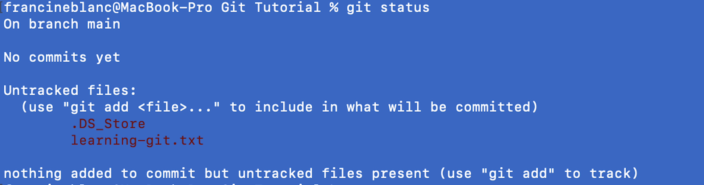
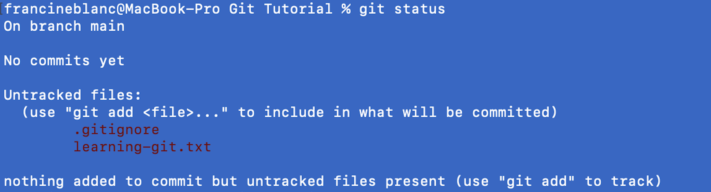

[Git]: https://www.codecademy.com/resources/docs/git
[following the instructions]: https://git-scm.com/downloads
[`git status`]: https://www.codecademy.com/resources/docs/git/status
[`git add`]: https://www.codecademy.com/resources/docs/git/add
[`git reset`]: https://www.codecademy.com/resources/docs/git/reset
[here]: https://www.theserverside.com/feature/Why-GitHub-renamed-its-master-branch-to-main
[GitHub]: https://github.com/
[conventions]: https://www.conventionalcommits.org/en/v1.0.0/

_**Prerequisites:** the Command Line_

## Introduction

[Git] is a version control system used for tracking changes to files over a period of time. Understanding Git is a fundamental skill for all developers as it is the modern standard in the software development industry for tracking and coordinating work within a dev team.

## Getting started

To get started, we will first check that Git is installed in our system by running the following command:

```bash
git --version
git version 2.35.3
```

If not installed, we can install Git by [following the instructions] on the Git website according to our operating system.

### Git workflow

Before using Git, it will be helpful to have an overview of a straightforward Git workflow. 

A Git project generally has the following:

- A working directory (or working tree) where project files are created, edited, and deleted on the computer.

- A staging area that contains the changes made to files in the working directory ready to be committed.

- A repository - also known as the "repo", the place where changes are saved by Git as different versions of the project. 

A local repo is created either when a remote repo is cloned onto our local machine, or when a project is created on a local machine and initialized as a Git repo. Remote repos are commonly hosted on providers like GitHub, GitLab, or Bitbucket.

The steps commonly taken in a Git workflow include the following:

1. Initializing Git in the working directory.
2. Working on files in the working directory, then adding these to the staging area.
3. Commmiting the changes from the staging area into the repo.

Let's unpack each of these steps.

## Initializing Git

To turn a working directory into a Git project, we navigate to the directory in the terminal/command prompt and run the following command:

```bash
git init
```

This initializes a local Git repo by creating a special **.git** folder inside a project. This is required in order for any changes to be tracked and pushed to the repo. This step might look like this:


When `git init` is run inside the **Git Tutorial** folder, an empty Git repo is created inside of that directory. The repo is currently empty because at this point, Git doesn't know which files it should track. Any untracked files can be viewed using the following command:

```bash
git status
```

This will display untracked files in red and will show some useful output confirming that nothing has been added. For example, if [`git status`] is run in the **Git Tutorial** folder, which now contains a file called **learning-git.txt**. The output would look like this:



The output will begin with "On branch main" which can be ignored for now. One of the files listed is one called **.DS_Store** that is automatically created by Mac OS X. This file contains information about system configurations, so should not be committed as part of the Git workflow. To make sure of this, a file called **.gitignore** should be made in the working directory.

### Ignoring changes in Git

The **.gitignore** file is a special file that generally lives in the root of the repo. It contains a list of files and directories that are excluded from being tracked or committed by Git. This may include log files, particular modules, or (for Mac users) files like **.DS_Store**. It is recommended that these files be added to **.gitignore** before anything is committed.

With **.gitignore** made and the **.DS_Store** file added, running `git status` will show the following output:



## Updating the staging area

In order for Git to start tracking changes, files need to be added to the staging area. This can be done with the [`git add`] command:

```pseudo
git add <filename>
```

The `<filename>` is the name and extension of the file to be added to the staging area. Multiple files can also be added by name with the following syntax:

```pseudo
git add <filename1> <filename2> <filename3>
```

If all files in the working directory need to be tracked, this syntax can be used, which should be run at the root directory:

```bash
git add .
```

Another command we can use to stage all changes is:

```bash
git add -A
```

Once a file has been added, `git status` can be run in the terminal/command prompt to check that the file is in the staging area. Git will show the changed files to be committed in green text:


### Unstaging a file

There may be occasions where a file has been incorrectly added to the staging area. This can be undone with the command `git reset <filename>`. This will not affect the changes done to the file in any way, it will simply remove it from the staging area. 

In the case where all files need to be unstaged, the command [`git reset`] can be run without adding further arguments.

As of version 2.24, there is an alternative syntax for unstaging files in Git: 

```pseudo
git restore --staged <filename>
``` 

The `<filename>` is the name of the file to be unstaged.

## Committing changes

Committing is generally the last step of the Git workflow and is generally thought of as being a snapshot of a project at a particular time. In this stage, changes in the staging area are saved inside the local repo, which is achieved with the command `git commit -m` followed by a space and a short message explaining the commit in quotes. For example:

```bash
git commit -m "Add title and description to intro file"
```

There are general [conventions] for writing a commit message including: 
- Making sure they are no more than 50 characters long.
- Writing them in the imperative or present tense. 

Messages should always be clear and informative to others who may go back to confirm what changes were made.

Committing is an important step in the Git workflow, as once a change has been committed, it can be recalled at a later date or the project can be rewound to that particular version. Commit history can be viewed with `git log`, which will display a list of commits in chronological order (the most recent commits being at the top), along with information such as the author of the commit, the date and time of the commit and the commit message.

### Undoing a commit

In the situation where the last commit needs to be undone, the `git reset` command can again be used, with some modifications. 

The current commit is called the `HEAD` commit, which is generally the most recently made commit. To find out which commit this is, the command `git show HEAD` can be executed in the terminal. This will display information about the most recent commit, including a unique 40 character SHA hash, which Git uses like an id to identify revisions in the repo.

To undo the immediately previous commit, the command `git reset --soft HEAD~1` can be run, which will rewind the current `HEAD` commit to the immediately previous commit. The `--soft` flag ensures that any changes made to the files are preserved.

If the rewind needs to go beyond the most recent commit, the command `git reset SHA`, where `SHA` is the first 7 characters of the SHA of the commit, can be used. Note that the SHA of all previous commits can be viewed using `git log`.
## Git branching

Previously, the output from running `git status` referred to being on `branch main`. Branches are a core feature in Git. They allow for new updates and features to be developed and tested without disrupting the `main` branch of the project.

The first branch to be aware of is the `HEAD` branch, which is the currently active branch. So, the `main` branch referenced above was the currently active branch and in GitHub is the name of the default branch. In Git, the default branch name is `master`, which was also originally the case in GitHub however this was renamed for the reasons outlined [here]. The main take away though is that both `master` and `main` are used as default branch names.

The idea of Git branches is that different branches can be created and worked on, and changes can be merged into the `main` branch. Branches are in effect an independent line for the adding/staging/committing process, forked from the `main` branch. Once on a branch, commits are recorded in that branch's history and when ready a branch (including the changes made on that branch) can be merged i.e. combined into `main`.

A new branch can be made with the following command:

```pseudo
git branch <name-of-new-branch>
```

Switching between branches can be done with the `git checkout` command:

```pseudo
git checkout <name-of-the-branch>
```

It is also possible to create and switch into a new branch with one command:

```pseudo
git checkout -b <name-of-new-branch>
```

Once on a new branch, files in the working directory can be worked on as usual, and changes can be added and committed. Those changes will however only be committed to the current branch and will not affect anything on `main`.

### Merging

Merging combines multiple commits into one history and is generally used to join or combine two branches. So, when ready for work on a branch to be merged into `main`, the command `git merge branch-name` is used, where `branch-name` is the name of the branch to be merged into the `main` branch. This command is most often used when working on a project with others (more on this below).

Once a branch has been merged, it is no longer needed so can be deleted with:

```pseudo
git branch -d <branch-name>
``` 

This will only delete the branch once it has been merged into the `main` branch. Replacing the `-d` flag with `-D` will force-delete the branch.

## Collaboration

When collaborating with others on a project, it is generally the case that a shared remote Git repo will exist so that multiple people can work on the same project from different locations. Today, there is a wide range of providers of remote repos.

### GitHub

One of the most popular and well-known providers is [GitHub]. It utilizes Git version control for project creation and collaboration between teams. Using GitHub can feel like a skill in and of itself.

### Workflow

When working with others, the following steps are generally taken:

1. Create a remote repo with a provider like GitHub.
2. Combine (pulling) changes from a remote repo into a local branch
3. Clone the remote repo to a local repo, which copies everything in the remote to a local copy of the Git project.
4. Create a new local branch forked from `main` to work on the new feature or fix.
5. Add and commit changes.
6. Push changes to the remote and create a pull request for the changes to be reviewed by other team members.
7. Merge the local branch with `main` once the changes have been approved by team members.

Let's take a closer look at steps 2 and 5.

### Updating branches

To keep the local repo up to date with the remote repo, changes can be fetched and merged from the remote and integrated into the local branch. This can be done in two stages using `git fetch` and `git merge` or in one step using `git pull`.

`git fetch` downloads files and commits from a remote repo into the local repo. It is used to see what changes have been made to the remote before they are merged into the local repo.

Fetching all branches from the remote can be achieved with `git fetch <remote-name>`.

Alternatively, a specific branch can be fetched with `git fetch <remote-name><branch-name>`.

Lastly, all registered remotes and their associated branches can be achieved with `git fetch --all`.

`git fetch` does not automatically merge changes made in the remote repo to the local repo, so is useful in cases where code needs to be reviewed before being locally merged. To merge changes into the local repo, the usual `git merge` command is required.

The `git fetch <remote>` and `git merge origin <local-branch>` command is combined as one into the `git pull` command, which automatically fetches and merges changes from a remote into the local branch. `git pull` can be run as a standalone command or with options such as `git pull <remote-name>` which will fetch and merge a specified remote with the local branch.

It is important to keep a habit of updating the local repo of a codebase being remotely worked on with others in a team. This includes fetching and merging or pulling changes from the remote branch.

It is also important to form a habit of fetching and merging or pulling when working in a team to make sure the codebase being worked on locally is always up to date with the remote.

### Pushing

When collaborating on a project, it is often the case that to (amongst other reasons) prevent broken code from being added to the main development branch and/or to ensure code is correctly formatted and follows whatever code conventions have been set by the team, those who have not been working on the new feature or fix will be asked to review the code. 

Code reviews are an important part of quality assurance in software development and not only help protect against broken code from being mistakenly included in a codebase but also help share knowledge amongst a team and can help develop the skills of both the reviewer and author.

One of the advantages of creating branches, rather than working off `main` is that any changes made to that branch do not affect the work of any other developers in the team. When a branch is pushed up to the remote, the team members can also take the time to review the code properly without needing to worry that there may be broken code included in `main`.

To push code to the remote repo, the `git push` command is used as follows:

```pseudo
git push <remote-branch-name> <local-branch-name>
```

This command pushes the local branch, along with all of the changes which have been committed to that branch, to the remote destination repo. If the remote branch does not already exist, one will be automatically created with the name of the local branch. An alternative syntax to this is:

```pseudo
git push origin <local-branch-name>
```

This also pushes the current local branch to a remote branch of the same name.

Once pushed, a pull request (sometimes called a merge request or "PR") can be created. PRs are generally requests for merging changes into the `main` branch of the remote repo. Although the command line has been used throughout this article, there are some cases where using the GUI (Graphical User Interface) of GitHub is another option. This is the case when creating a PR, which can be done through the GUI of all of the major hosting services.

### Pull requests

After the PR is created, other team members can review the code and make suggested changes. Changes can be requested with either of the following methods:
- They can be made locally and committed/pushed to the remote branch with the usual `add/commit` commands as described above.
- If direct changes to the files are suggested, they can be made and committed to the remote repo from within the GUI of the hosting provider.

## Conclusion

In this article, we learned to use Git including how to add and commit changes. We also explored important Git concepts like branching and workflows. Lastly, we looked at a straightforward GitHub workflow for collaborating with others on projects.

Learning to use Git is similar to learning a new programming language and can be improved with time, practice, and patience. Since GitHub and Git are among the industry standards for collaboration and version control, respectively, they are important for beginners to get familiar with.